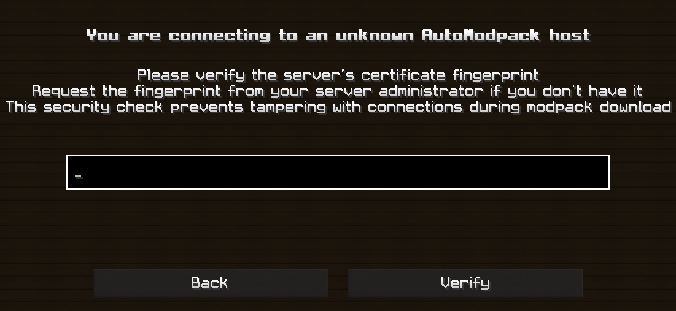
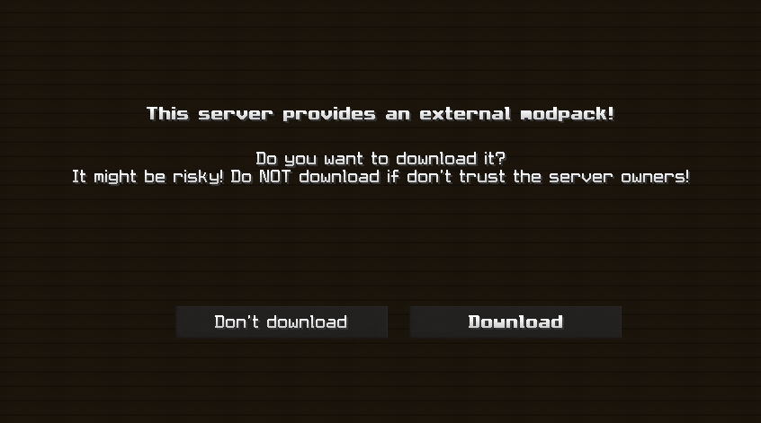
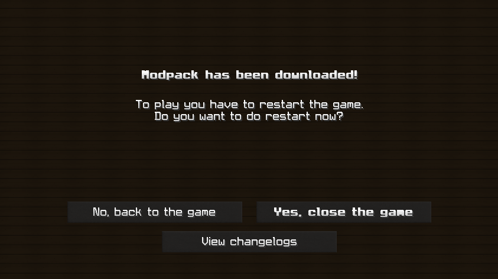

# 🚀 Guía de instalación automática con AutoModpack

Con esta nueva actualización, **instalar y mantener actualizado el Modpack de Azgard es más fácil que nunca** 🎉.  
Gracias a **AutoModpack**, todo el proceso es automático y seguro ✅.

---

## 📥 Paso previo obligatorio (una sola vez)

Antes de entrar al servidor por primera vez con AutoModpack:  

1. Descargá el siguiente mod:  
   🔗 [AutoModpack Client Mod](<https://www.curseforge.com/minecraft/mc-mods/automodpack/download/6694475>)
3. Copiá el archivo `.jar` en la carpeta `mods/` de tu instalación de Minecraft  
   (en Windows normalmente está en `%appdata%/.minecraft/mods`).
   NO es necesario que elimines o modifiques nada más.  
4. Luego iniciá el juego normalmente.

👉 **Este paso solo se hace una vez.** A partir de ahí, AutoModpack mantendrá todo actualizado automáticamente.

---

## 🔑 Paso 1 – Verificación del host
Al entrar al servidor, aparecerá una pantalla de seguridad para validar la conexión.  
📌 **Pegá el hash que te compartimos en Discord** en el campo de texto y presioná **Verify**.

---

## 📦 Paso 2 – Confirmar la descarga del modpack
El juego te preguntará si querés descargar el modpack externo que provee el servidor.  
👉 Presioná **Download** (es seguro, proviene de nuestro servidor oficial).

---

## ⏳ Paso 3 – Descarga de mods
Se abrirá la pantalla de progreso.  
📥 **Esperá a que termine la descarga de todos los mods** (puede tardar unos minutos según tu conexión).

---

## 🔄 Paso 4 – Reinicio del juego
Cuando finalice la descarga, verás el mensaje de confirmación.  

⚠️ Para evitar errores, **NO elijas “Yes, close the game”**.  
👉 Seleccioná **“No, back to the game”** y cerrá Minecraft de la forma habitual desde el menú o el launcher.  

Luego volvé a abrir el launcher y conectate al servidor: ¡ya estarás sincronizado! 🎮

---

## 🎯 Conclusión
- 🔄 **Actualización automática**: nunca más descargas manuales.  
- 🛡️ **Seguro y confiable**: validación por hash para proteger tu conexión.  
- ⏱️ **Más rápido y simple**: entrás al server y listo, ¡todo se sincroniza solo!  

⚡ Con **AutoModpack**, jugar en Azgard es ahora más fácil, rápido y seguro que nunca.  
